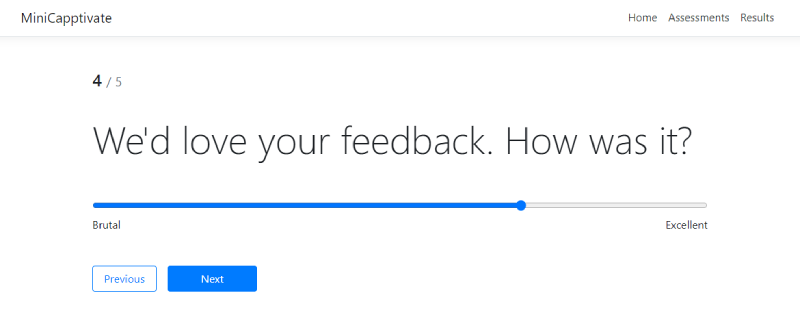

# Cappfinity Coding Test

At Cappfinity one of the core things we do is build sophisticated online assessments used to evaluate candidates applying for jobs. This is done by our professional psychologists using our flagship product, Capptivate.

An online assessment is a series of questions which are presented to a candidate. We record their answers and score the results to help our customers choose the right people to hire. This all gets pretty interesting with complex scoring methodologies grounded in strengths based psychology, online job simulations, video responses and more.

For your coding test we'd like you to take a peek into the world of online assessments by working on MiniCapptivate, a small demo project (not our production code) which provides a little of that assessments functionality.

## Coding Test Instructions

1.  Spend up to 3 hours on the Coding Test Tasks described below
2.  You are allowed to use the internet, Google, documentation, Stack Overflow etc.
3.  Don't worry if you don't finish all the tasks fully; you can talk us through your progress and reasoning during a second round interview
4.  App uses EntityFramework.InMemory database. When adding new functionality or question types remember to add these to the seeded data in `CapptivateDbContext.cs` so we can see them in your solution.
5.  Once you have finished your work on the coding test please zip up your entire solution without any binaries or packages and send it to nick.mullally-watts@cappfinity.com. This zip file is likely to be blocked by our spam filters so please send it using your choice of a service like wetransfer.com, or hosting it in your own Google Drive, DropBox etc. and emailing a link for download.

## Existing Functionality in MiniCapptivate

1.  Ability to have many online assessments, each with a name and a unique URL (in the form of `/take/{id}`).
2.  Each assessment is made up of many questions.
3.  Questions have question text and are of one of the following types:
    -   Text
    -   Number
    -   Choice (radio button)
4.  Visiting the unique URL of the assessment allows you to take the assessment. Taking the assessment means entering your email address (which can be considered unique) and then answer each question in turn, saving the results for your assessment instance as you go.
5.  Entering your email and starting an assessment creates the unique URL (`/instance/{id}`) for that assessment instance. This means you can come back to a partialy completed assessment instance if you know the URL. In this demo app, no authentication is needed.
6.  It is not allowed for the same email address to be used to take the same assessment twice.
7.  The results are persisted in EntityFrameworkCore.InMemory database.
8.  There is a simple way to view all the results for an assessment.

## Coding Test Tasks

1.  Add a simple mechanism for automatically scoring completed assessment instances:
    -   1 point should be awarded if the value entered when answering a question matches an expected value
    -   Assessments should have a Total Score
    -   The ability to view total scores for all candidates on the Results view (scored X out of possible total Y)
    -   Not all questions will have one correct answer (i.e. feedback questions). These should be considered non-scorable questions and shouldn't be counted against the total score.
    -   Expected values to questions should be defined in the `CapptivateDbContext.cs` file
2.  Add a new question type - Slider:
    -   Ability to have questions which use a slider control. This is a control which allows the user to drag a pointer left and right on a small horizontal bar to enter their answer to a question using the intergers 0 to 10.
    -   The left and right labels of the control should be configurable
    -   Define a new question of type slider in the `CapptivateDbContext.cs` file
    
3.  Fix your choice of 2 of the following bugs:
    -   The answer given to the last question when taking an assessment isn't saved
    -   CompletedDate isn't populated when finishing the assessment
    -   You can still edit your answers after finishing assessment if you use the instance URL (`/instance/{id}`)
    -   Invalid email addresses can be entered when starting the assessment
4.  Some questionable coding practices are evident both in the front end and back end of this demo project (not our production code!). You're not required to fix these but wherever you find them please leave a comment explaining what's wrong and how could it be improved.

## Dependencies

1.  .NET Core 3.1 SDK
2.  Node.js LTS version
3.  Angular CLI (`npm i -g @angular/cli`)

## To Run the App

1.  Run `npm install` and then `ng serve` in the `CAPP.MiniCapptivate/mini-capptivate-client` directory
2.  Open new console, run `dotnet run` in the `CAPP.MiniCapptivate/MiniCapptivate` directory
3.  Open your browser and navigate to <http://localhost:5000># capFinitiy

